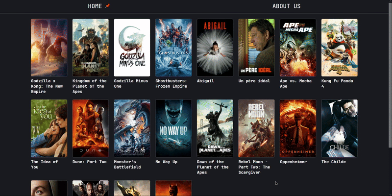
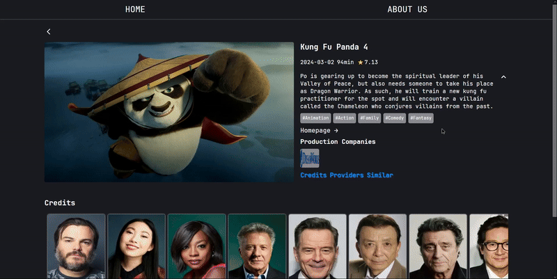
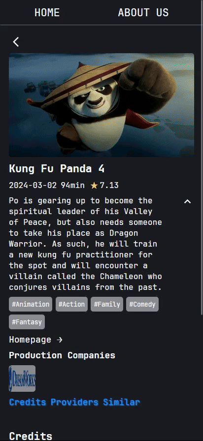

# Nextjs 14 movie app

### nomad-coders 에서 Nextjs14를 배우면서 만들어 본 movie app

### 사용한 기술 스택:

- ### React
- ### Nextjs14
- ### typescript

### 배포된 앱 [URL](https://nextjs-movies-psi-six.vercel.app/)

## 첫 화면

### 데스크탑

### 모바일

## 영화 정보 페이지

### 데스크탑

### 모바일

## 출연진 페이지

### 데스크탑

### 모바일

## 시청옵션

### 데스크탑

### 모바일

## 비슷한 영화들

### 데스크탑

### 모바일

